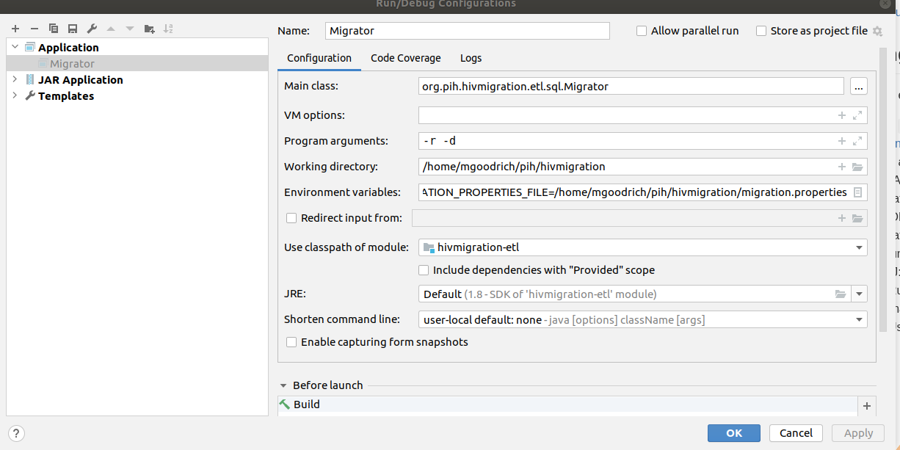

hivmigration
============

This project represents the code necessary to export HIV data into a format suitable for import into another system,
including a Java API that can be embedded in the target system to facilitate the import.

## Prerequisites

These steps will setup HIV EMR1, Oracle, Pentaho, and this code: 

1. Install HIV EMR system (both application and Oracle db) running locally using Docker, following these instructions:
https://bitbucket.org/partnersinhealth/hivemr/src/master/docker/

2. Install OpenMRS SDK with a clean database (ie. openmrs_hiv) for Haiti HIV:
   - https://wiki.openmrs.org/display/docs/OpenMRS+SDK#OpenMRSSDK-Installation
   - Use Lespwa-style setup with pih_config: haiti-hiv

3. Get the hivmigration project cloned and available to use locally:
https://github.com/PIH/hivmigration

## Migrating data

Instructions for executing commands from this java project 

1. Create file `migration.properties` from
   [etl/src/main/resources/sample-migration.properties](https://github.com/PIH/hivmigration/blob/master/etl/src/main/resources/sample-migration.properties).
   Check that the values are correct for your databases.
2. Set `MIGRATION_PROPERTIES_FILE` environment variable to point to that file, ie:
    `MIGRATION_PROPERTIES_FILE=/home/mgoodrich/pih/hivmigration/migration.properties`
3. Two ways to run the migration:
    - IntelliJ: Run `org.pih.hivmigration.etl.sql.Migrator.java` with a config like this one
       
      Run with the program argument `--help` to see the available options.
    - Command-line (may or may not still work): Use
      [ansible deployment playbook](https://bitbucket.org/partnersinhealth/deployment/src/master/playbooks/roles/hiv-migration/)
 
## Pentaho

Previously, we were writing the migration using Pentaho. We have switched 
to Java/SQL approach, but you'll need Pentaho to properly
view the existing Pentaho code:

Get Pentaho Data Integration installed locally (mainly so that you can use Spoon - now called "PDI client" to author jobs).  There should no difficulty with any version (Versions 6, 7, or 8 appear to work).  Download from SourceForge:
https://sourceforge.net/projects/pentaho/

